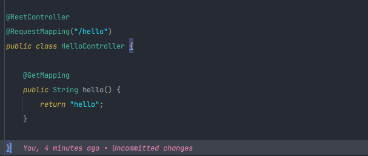
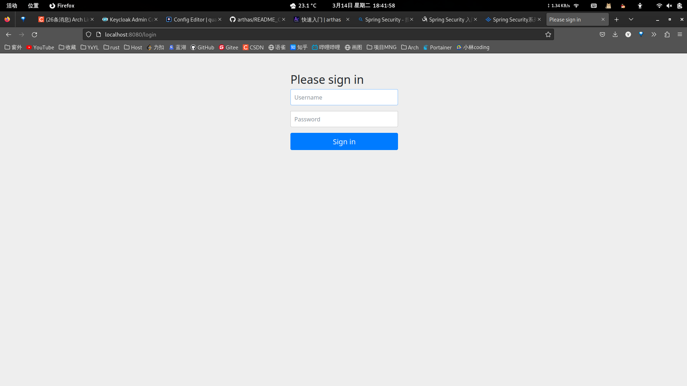
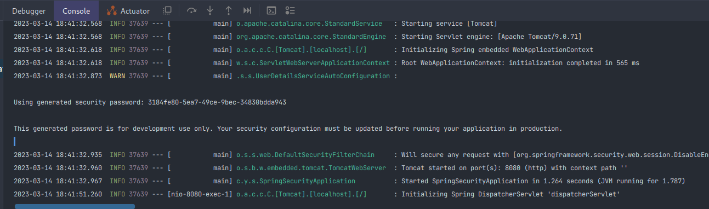
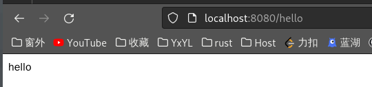
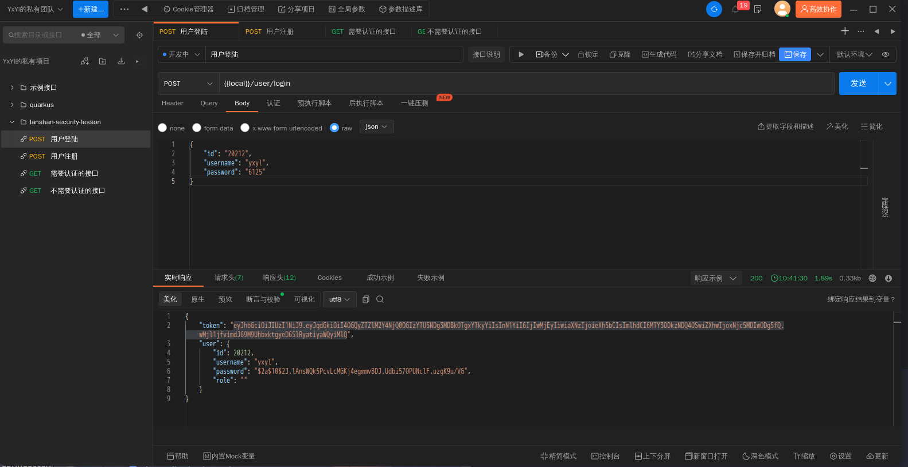

# 2023春季蓝山工作室第一次课

## Spring Security

Spring Security是一个功能强大且高度可定制的身份验证和访问控制框架。它是保护基于spring的应用程序的事实上的标准。

Spring Security是一个专注于为Java应用程序提供身份验证和授权的框架。像所有Spring项目一样，Spring Security的真正力量在于它可以很容易地扩展以满足定制需求

登录认证的大概流程：


springsecurity底层实现是通过一系列的过滤器链完成登录验证和授权等功能，主要是使用到下面15个过滤器


它的调用流程：


### JWT

什么是 JSON Web Token？

> JSON Web 令牌 （JWT） 是一种开放标准 （RFC 7519），它定义了一种紧凑且独立的方式，用于在各方之间以 JSON 对象的形式安全地传输信息。此信息可以验证和信任，因为它是经过数字签名的。JWT 可以使用密钥（使用 HMAC 算法）或使用 RSA 或 ECDSA 的公钥/私钥对进行签名。

尽管 JWT 可以加密以提供各方之间的保密性，但我们将专注于签名令牌。签名令牌可以验证其中包含的声明的完整性，而加密令牌则向其他方隐藏这些声明。当使用公钥/私钥对对令牌进行签名时，签名还证明只有持有私钥的一方才是签名的一方。

特点：跨平台 跨语言 轻量级json 对象进行数据传输， 数字签名保证安全性

应用场景：

- 授权：这是使用 JWT 的最常见方案。用户登录后，每个后续请求都将包含 JWT，允许用户访问使用该令牌允许的路由、服务和资源。单点登录是当今广泛使用 JWT 的一项功能，因为它的开销很小，并且能够跨不同域轻松使用。

- 信息交换：JSON Web 令牌是在各方之间安全传输信息的好方法。由于 JWT 可以签名（例如，使用公钥/私钥对），因此您可以确定发件人是他们所说的人。此外，由于签名是使用标头和有效负载计算的，因此您还可以验证内容是否未被篡改


从本质上来说，JWT 就像是一种生成加密用户身份信息的 Token，更安全也更灵活。


### 开始工作

> 1. ```java
>    <dependency>
>        <groupId>org.springframework.boot</groupId>
>        <artifactId>spring-boot-starter-security</artifactId>
>    </dependency>
>    ```
>
> 2. 开写……

在导完依赖过后，我们直接写一个简单的hello接口

注意：这里请导 springboot 3.0 以下版本的依赖



然后我们启动项目，并且访问这个接口：`localhost:8080/hello`

本来应该出现hello字符串返回的，但是页面却出现了让我们的登陆的界面：



这生活你就回想：

> 我￥%……&*（——，我自己从创建项目到遇见你，什么时候设置或者见过username,password啊

诶～，别急，细心的你已经发现了，在控制台已经输出了我们想要的password：



然后username：user

如果我们不设置账号密码的话，Spring Security 默认就会给我们配置账号密码

在输入username,password过后，我们就可以看到想看到的hello了



当然，如果你想自己设置密码的话：

```yml
server:
  port: 8080
spring:
  security:
    user:
      password: 6125
```

综上：在不配置任何信息的情况下，Spring Security 会为我们拦截所有的资源访问，但是这与我们开发的需求相比还远远不够……


### 配置Sucurity

在开发过程中，我们总有一些接口是不能直接对外暴漏出去的，其调用者必须拥有某些权限，才能获取相关接口资源，所以，我们通过自定义SecurityConfig配置类，去继承`WebSecurityConfigurerAdapter`，重写`protected void configure(HttpSecurity http)`方法，来配置我们自己的授权认证规则


这个是最开始的配置类：

```java
package com.yxyl.springboot.config;

import org.apache.catalina.filters.AddDefaultCharsetFilter;
import org.springframework.context.annotation.Bean;
import org.springframework.context.annotation.Configuration;
import org.springframework.security.authentication.AuthenticationManager;
import org.springframework.security.config.annotation.web.builders.HttpSecurity;
import org.springframework.security.config.annotation.web.configuration.WebSecurityConfigurerAdapter;
import org.springframework.security.config.http.SessionCreationPolicy;
import org.springframework.security.crypto.bcrypt.BCryptPasswordEncoder;
import org.springframework.security.crypto.password.PasswordEncoder;

@Configuration
public class SecurityConfig extends WebSecurityConfigurerAdapter {


    @Override
    protected void configure(HttpSecurity http) throws Exception {
        http
                .cors()//允许跨域
                .and()
                .csrf().disable()//关闭csrf
                .authorizeRequests()
//                .antMatchers("/").anonymous()
                .antMatchers("/user").permitAll()
                .anyRequest().authenticated();
        
        http.formLogin().permitAll();
    }

    @Bean//这个东西等下可由大用处
    @Override
    public AuthenticationManager authenticationManagerBean() throws Exception {
        return super.authenticationManagerBean();
    }
}
```

这里我们设置了：

> 1. `/user`这个接口，任何人都是可以访问的
> 2. 除了`/user`接口之外，其他的接口(/hello)必须需要认证授权才能访问

到这里你会想，我不可能在访问需要授权的资源的时候，每次都要经过这样一个很丑，很丑，很丑的界面吧，所以，我们吧登陆界面这样的事情交给前端


### 完成我们的登陆功能

接下来就可以完成我们的登陆功能了

先创建一个User类和UserRespnse：

```java
package com.yxyl.springboot.model;

import com.baomidou.mybatisplus.annotation.TableName;
import lombok.AllArgsConstructor;
import lombok.Data;
import lombok.NoArgsConstructor;
import lombok.ToString;

import java.io.Serializable;

@Data
@AllArgsConstructor
@NoArgsConstructor
@ToString
@TableName("user")

public class User implements Serializable {
    private Long id;
    private String username;
    private String password;
    private String role;
}
==============================================================================================================
package com.yxyl.springboot.model.auth;

import com.yxyl.springboot.model.User;
import lombok.AllArgsConstructor;
import lombok.Data;
import lombok.NoArgsConstructor;
import lombok.ToString;

@Data
@AllArgsConstructor
@NoArgsConstructor
@ToString
public class UserResponse {
    private String token;
    private User user;
}
```

我们在UserController里面编写一个Post请求的login接口

```java
    @PostMapping("/login")
    public UserResponse login(@RequestBody User user) {
        if (user == null) {
            throw new RuntimeException("user can not be null");
        }
        return userService.login(user);
    }
```

UserServiceIml：

```java
public final UserMapper userMapper;
private final PasswordEncoder passwordEncoder;
private final AuthenticationManager authenticationManager;
private final RedisCache redisCache;

 @Override
    public UserResponse login(User user) {
        UsernamePasswordAuthenticationToken
                authenticationToken = new UsernamePasswordAuthenticationToken(user.getUsername(), user.getPassword());
        Authentication authenticate = authenticationManager.authenticate(authenticationToken);
        LoginUser loginUser = (LoginUser) authenticate.getPrincipal();

        String studentId = loginUser.getUser().getId().toString();

        String token = JwtUtil.createJWT(studentId);
        
        //这里还可以吧loginUser信息放在Redis里面，方便以后的功能模块会用到
        redisCache.setCacheObject(REDIS_KEY + studentId, loginUser, 30, TimeUnit.MINUTES);

        return new UserResponse(token, loginUser.getUser());
    }
```

我们首先进行一个“授权管理者的验证”过程

这个`AuthenticationManager`就是我们在SecurityConfig里面注入进去的，用于登陆前的验证
`authenticationManager.authenticate()`方法就是验证方法

这里需要我们实现`UserDetailsService`接口，重写`loadUserByUsername(String str)`方法

代码如下：

```java
package com.yxyl.springboot.service.impl;

import com.baomidou.mybatisplus.core.conditions.query.LambdaQueryWrapper;
import com.yxyl.springboot.mapper.UserMapper;
import com.yxyl.springboot.model.User;
import com.yxyl.springboot.model.auth.LoginUser;
import lombok.AllArgsConstructor;
import org.springframework.security.core.userdetails.UserDetails;
import org.springframework.security.core.userdetails.UserDetailsService;
import org.springframework.security.core.userdetails.UsernameNotFoundException;
import org.springframework.stereotype.Service;

@Service
@AllArgsConstructor
public class UserDetailServiceImpl implements UserDetailsService {
    private final UserMapper userMapper;

    @Override
    public UserDetails loadUserByUsername(String username) throws UsernameNotFoundException {
        //在“认证授权管理器的认证”方法之前，先判断是否有这个用户
        User user = userMapper.selectOne(new LambdaQueryWrapper<User>().eq(User::getUsername, username));
        if (user == null) {
            System.out.println("用户不存在");
            throw new UsernameNotFoundException("用户不存在");
        }
        //TODO 查询权限信息封装
        return new LoginUser(user);
    }
}
```

通过代码我们可以看到，这个所谓的“登陆前校验”无非就是验证传进来User的studentId是否在数据库中存在，如果不存在就直接报错返回，不再进行后续的登陆逻辑（比如密码是否正确之类的）了;如果存在的话，就将其封装成`LoginUser`返回

LoginUser 实现 UserDetails接口：UserDetails是Security中为我们提供的可实现的**认证用户的接口**

```java
package com.yxyl.springboot.model.auth;

import com.yxyl.springboot.model.User;
import lombok.AllArgsConstructor;
import lombok.Data;
import lombok.NoArgsConstructor;
import org.springframework.security.core.GrantedAuthority;
import org.springframework.security.core.userdetails.UserDetails;

import java.util.Collection;

@AllArgsConstructor
@NoArgsConstructor
@Data
public class LoginUser implements UserDetails {

    private User user;


    @Override
    public Collection<? extends GrantedAuthority> getAuthorities() {
        return null;
    }

    @Override
    public String getPassword() {
        return user.getPassword();
    }

    @Override
    public String getUsername() {
        return user.getUsername();
    }

    @Override
    public boolean isAccountNonExpired() {
        return true;
    }

    @Override
    public boolean isAccountNonLocked() {
        return true;
    }

    @Override
    public boolean isCredentialsNonExpired() {
        return true;
    }

    @Override
    public boolean isEnabled() {
        return true;
    }
}
```


OK到这里，我们的登陆功能就写完力(ง •̀_•́)ง

我们来测试一下吧：



可以看到，返回来我们封装的UserResponse

现在我们的登陆已经完成力～

在我们登陆过后，想要访问那些需要授权认证的接口的时候，还需要一个拦截器：`JwtAuthenticationTokenFilter`这个自定义拦截器继承了`OncePerRequestFilter`，实现了`doFilterInternal`方法

```java
package com.yxyl.springboot.filter;

import com.yxyl.springboot.model.auth.LoginUser;
import com.yxyl.springboot.utils.JwtUtil;
import com.yxyl.springboot.utils.RedisCache;
import io.jsonwebtoken.Claims;
import org.springframework.security.authentication.UsernamePasswordAuthenticationToken;
import org.springframework.security.core.context.SecurityContextHolder;
import org.springframework.stereotype.Component;
import org.springframework.web.filter.OncePerRequestFilter;

import javax.annotation.Resource;
import javax.servlet.FilterChain;
import javax.servlet.ServletException;
import javax.servlet.http.HttpServletRequest;
import javax.servlet.http.HttpServletResponse;
import java.io.IOException;


@Component
public class JwtAuthenticationTokenFilter extends OncePerRequestFilter {

    private static final String REDIS_KEY = "USER_LOGIN:";
    @Resource
    RedisCache redisCache;


    @Override
    protected void doFilterInternal(HttpServletRequest request,
                                    HttpServletResponse response,
                                    FilterChain filterChain) throws ServletException, IOException {
        //这里就是重写拦截方法
        String token = request.getHeader("token");
        if (null == token || "".equals(token)) {
            // token不存在 放行 并且直接return 返回
            filterChain.doFilter(request, response);
            return;
        }
        // 解析toke
        String userId = null;
        try {
            Claims claims = JwtUtil.parseJWT(token);
            userId = claims.getSubject();
        } catch (Exception e) {
            throw new RuntimeException("token非法");
        }
        // 获取userid 从redis中获取用户信息
        LoginUser loginUser = redisCache.getCacheObject(REDIS_KEY + userId);
        if (Objects.isNull(loginUser)) {
            throw new RuntimeException("用户未登录");
        }

        //将用户信息存入到SecurityContextHolder
        UsernamePasswordAuthenticationToken authenticationToken = new UsernamePasswordAuthenticationToken(loginUser, null, loginUser.getAuthorities());
        SecurityContextHolder.getContext().setAuthentication(authenticationToken);
        // 放行
        filterChain.doFilter(request, response);
    }
}
```

写完拦截器过后，别忘了在配置类中配置这个拦截器：

```java
@Resource
private JwtAuthenticationTokenFilter authenticationTokenFilter;

 @Override
    protected void configure(HttpSecurity http) throws Exception {
		//...
        //添加前置过滤波器
        http.addFilterBefore(authenticationTokenFilter, UsernamePasswordAuthenticationFilter.class);
		//..
    }
```

Ok这个时候我们的拦截器就配置完成力

> 综上，我们的认证过程，总之解释要获取`authenticate`认证：
>
> - 自定义登录接口
>   1. 定义LoginController，调用LoginService接口
>   2. service里调用**`AuthenticationManager`**的**`authenticate`**方法获得**`Authentication`**对象，其中传入参数**`UsernamePasswordAuthenticationToken`**
>      1. 参数**`UsernamePasswordAuthenticationToken`** 用 **`new`**的；参数为**用户名账号密码**
>   3. 得到**`Authentication`**后调用**`getPrincipal`**方法获取**`LoginUser`**对象
>   4. **`LoginUser`**对象得到**`User`**进行验证
>   5. 调用**`ProviderManager`**的方法进行认证，通过则生成jwt
>   6. 把用户信息存入redis
> - 定义Jwt认证过滤器
>   1. 获取token
>   2. 解析token获取其中的userid
>   3. 从redis中获取用户信息
>   4. 存入SecurityContextHolder
> - 退出登录
>   1. 从SecurityContextHolder中的获取认证信息
>   2. 拿到userId
>   3. 删除redis中对应的数据即可。

### 留个小作业

1. 这里我们介绍了怎么通过Security进行认证的过程，请你下来自己研究授权的过程，比如哪些接口只能哪些角色的用户才能访问之类的……
1. 梳理一下整个SpringSecurity的认证过程，以包括但不限于流程图的方式呈现


## StreamApi


## Stream流

### 概述

​	Java8的Stream使用的是函数式编程模式，如同它的名字一样，它可以被用来对集合或数组进行链状流式的操作。可以更方便的让我们对集合或数组操作。


### 案例数据准备

~~~~xml
    <dependencies>
        <dependency>
            <groupId>org.projectlombok</groupId>
            <artifactId>lombok</artifactId>
            <version>1.18.16</version>
        </dependency>
    </dependencies>
~~~~


~~~~java
@Data
@NoArgsConstructor
@AllArgsConstructor
@EqualsAndHashCode//用于后期的去重使用
public class Author {
    //id
    private Long id;
    //姓名
    private String name;
    //年龄
    private Integer age;
    //简介
    private String intro;
    //作品
    private List<Book> books;
}
~~~~

~~~~java
@Data
@AllArgsConstructor
@NoArgsConstructor
@EqualsAndHashCode//用于后期的去重使用
public class Book {
    //id
    private Long id;
    //书名
    private String name;

    //分类
    private String category;

    //评分
    private Integer score;

    //简介
    private String intro;

}
~~~~

~~~~java
    private static List<Author> getAuthors() {
        //数据初始化
        Author author = new Author(1L,"蒙多",33,"一个从菜刀中明悟哲理的祖安人",null);
        Author author2 = new Author(2L,"亚拉索",15,"狂风也追逐不上他的思考速度",null);
        Author author3 = new Author(3L,"易",14,"是这个世界在限制他的思维",null);
        Author author4 = new Author(3L,"易",14,"是这个世界在限制他的思维",null);

        //书籍列表
        List<Book> books1 = new ArrayList<>();
        List<Book> books2 = new ArrayList<>();
        List<Book> books3 = new ArrayList<>();

        books1.add(new Book(1L,"刀的两侧是光明与黑暗","哲学,爱情",88,"用一把刀划分了爱恨"));
        books1.add(new Book(2L,"一个人不能死在同一把刀下","个人成长,爱情",99,"讲述如何从失败中明悟真理"));

        books2.add(new Book(3L,"那风吹不到的地方","哲学",85,"带你用思维去领略世界的尽头"));
        books2.add(new Book(3L,"那风吹不到的地方","哲学",85,"带你用思维去领略世界的尽头"));
        books2.add(new Book(4L,"吹或不吹","爱情,个人传记",56,"一个哲学家的恋爱观注定很难把他所在的时代理解"));

        books3.add(new Book(5L,"你的剑就是我的剑","爱情",56,"无法想象一个武者能对他的伴侣这么的宽容"));
        books3.add(new Book(6L,"风与剑","个人传记",100,"两个哲学家灵魂和肉体的碰撞会激起怎么样的火花呢？"));
        books3.add(new Book(6L,"风与剑","个人传记",100,"两个哲学家灵魂和肉体的碰撞会激起怎么样的火花呢？"));

        author.setBooks(books1);
        author2.setBooks(books2);
        author3.setBooks(books3);
        author4.setBooks(books3);

        List<Author> authorList = new ArrayList<>(Arrays.asList(author,author2,author3,author4));
        return authorList;
    }
~~~~


### 快速入门

#### 需求

​	我们可以调用getAuthors方法获取到作家的集合。现在需要打印所有年龄小于18的作家的名字，并且要注意去重。

#### 实现

~~~~java
        //打印所有年龄小于18的作家的名字，并且要注意去重
        List<Author> authors = getAuthors();
        authors.
                stream()//把集合转换成流
                .distinct()//先去除重复的作家
                .filter(author -> author.getAge()<18)//筛选年龄小于18的
                .forEach(author -> System.out.println(author.getName()));//遍历打印名字
~~~~


### 常用操作

#### 创建流

单列集合： `集合对象.stream()`

~~~~java
        List<Author> authors = getAuthors();
		Stream<Author> stream = authors.stream();
~~~~

数组：`Arrays.stream(数组) `或者使用`Stream.of`来创建

~~~~JAVA
        Integer[] arr = {1,2,3,4,5};
        Stream<Integer> stream = Arrays.stream(arr);
        Stream<Integer> stream2 = Stream.of(arr);
~~~~

双列集合：转换成单列集合后再创建

~~~~java
        Map<String,Integer> map = new HashMap<>();
        map.put("蜡笔小新",19);
        map.put("黑子",17);
        map.put("日向翔阳",16);

        Stream<Map.Entry<String, Integer>> stream = map.entrySet().stream();
~~~~


#### 中间操作

##### filter

​	可以对流中的元素进行条件过滤，符合过滤条件的才能继续留在流中。


例如：

​	打印所有姓名长度大于1的作家的姓名

~~~~java
        List<Author> authors = getAuthors();
        authors.stream()
                .filter(author -> author.getName().length()>1)
                .forEach(author -> System.out.println(author.getName()));
~~~~


##### map

​	可以把对流中的元素进行计算或转换。

例如：

​	打印所有作家的姓名

~~~~java
        List<Author> authors = getAuthors();

        authors
                .stream()
                .map(author -> author.getName())
                .forEach(name->System.out.println(name));
~~~~

~~~~java
//        打印所有作家的姓名
        List<Author> authors = getAuthors();

//        authors.stream()
//                .map(author -> author.getName())
//                .forEach(s -> System.out.println(s));

        authors.stream()
                .map(author -> author.getAge())
                .map(age->age+10)
                .forEach(age-> System.out.println(age));
~~~~


##### distinct

​	可以去除流中的重复元素。


例如：

​	打印所有作家的姓名，并且要求其中不能有重复元素。

~~~~java
        List<Author> authors = getAuthors();
        authors.stream()
                .distinct()
                .forEach(author -> System.out.println(author.getName()));
~~~~


**注意：distinct方法是依赖Object的equals方法来判断是否是相同对象的。所以需要注意重写equals方法。**


##### sorted

​	可以对流中的元素进行排序。

例如：

​	对流中的元素按照年龄进行降序排序，并且要求不能有重复的元素。

~~~~java
        List<Author> authors = getAuthors();
//        对流中的元素按照年龄进行降序排序，并且要求不能有重复的元素。
        authors.stream()
                .distinct()
                .sorted()
                .forEach(author -> System.out.println(author.getAge()));
~~~~

~~~~java
        List<Author> authors = getAuthors();
//        对流中的元素按照年龄进行降序排序，并且要求不能有重复的元素。
        authors.stream()
                .distinct()
                .sorted((o1, o2) -> o2.getAge()-o1.getAge())
                .forEach(author -> System.out.println(author.getAge()));
~~~~


**注意：如果调用空参的sorted()方法，需要流中的元素是实现了Comparable。**

​		


##### limit	

​	可以设置流的最大长度，超出的部分将被抛弃。


例如：

​	对流中的元素按照年龄进行降序排序，并且要求不能有重复的元素,然后打印其中年龄最大的两个作家的姓名。

~~~~java
        List<Author> authors = getAuthors();
        authors.stream()
                .distinct()
                .sorted()
                .limit(2)
                .forEach(author -> System.out.println(author.getName()));
~~~~


##### skip

​	跳过流中的前n个元素，返回剩下的元素


例如：

​	打印除了年龄最大的作家外的其他作家，要求不能有重复元素，并且按照年龄降序排序。

~~~~java
//        打印除了年龄最大的作家外的其他作家，要求不能有重复元素，并且按照年龄降序排序。
        List<Author> authors = getAuthors();
        authors.stream()
                .distinct()
                .sorted()
                .skip(1)
                .forEach(author -> System.out.println(author.getName()));
~~~~


##### flatMap

​	map只能把一个对象转换成另一个对象来作为流中的元素。而flatMap可以把一个对象转换成多个对象作为流中的元素。


例一：

​	打印所有书籍的名字。要求对重复的元素进行去重。

~~~~java
//        打印所有书籍的名字。要求对重复的元素进行去重。
        List<Author> authors = getAuthors();

        authors.stream()
                .flatMap(author -> author.getBooks().stream())
                .distinct()
                .forEach(book -> System.out.println(book.getName()));
~~~~


例二：

​	打印现有数据的所有分类。要求对分类进行去重。不能出现这种格式：哲学,爱情

~~~~java
//        打印现有数据的所有分类。要求对分类进行去重。不能出现这种格式：哲学,爱情     爱情
        List<Author> authors = getAuthors();
        authors.stream()
                .flatMap(author -> author.getBooks().stream())
                .distinct()
                .flatMap(book -> Arrays.stream(book.getCategory().split(",")))
                .distinct()
                .forEach(category-> System.out.println(category));
~~~~


#### 终结操作

##### forEach

​	对流中的元素进行遍历操作，我们通过传入的参数去指定对遍历到的元素进行什么具体操作。


例子：

​	输出所有作家的名字

~~~~java
//        输出所有作家的名字
        List<Author> authors = getAuthors();

        authors.stream()
                .map(author -> author.getName())
                .distinct()
                .forEach(name-> System.out.println(name));

~~~~


##### count

​	可以用来获取当前流中元素的个数。

例子：

​	打印这些作家的所出书籍的数目，注意删除重复元素。

~~~~java
//        打印这些作家的所出书籍的数目，注意删除重复元素。
        List<Author> authors = getAuthors();

        long count = authors.stream()
                .flatMap(author -> author.getBooks().stream())
                .distinct()
                .count();
        System.out.println(count);
~~~~


##### max&min

​	可以用来或者流中的最值。

例子：

​	分别获取这些作家的所出书籍的最高分和最低分并打印。

~~~~java
//        分别获取这些作家的所出书籍的最高分和最低分并打印。
        //Stream<Author>  -> Stream<Book> ->Stream<Integer>  ->求值

        List<Author> authors = getAuthors();
        Optional<Integer> max = authors.stream()
                .flatMap(author -> author.getBooks().stream())
                .map(book -> book.getScore())
                .max((score1, score2) -> score1 - score2);

        Optional<Integer> min = authors.stream()
                .flatMap(author -> author.getBooks().stream())
                .map(book -> book.getScore())
                .min((score1, score2) -> score1 - score2);
        System.out.println(max.get());
        System.out.println(min.get());
~~~~


##### collect

​	把当前流转换成一个集合。


例子：

​	获取一个存放所有作者名字的List集合。

~~~~java
//        获取一个存放所有作者名字的List集合。
        List<Author> authors = getAuthors();
        List<String> nameList = authors.stream()
                .map(author -> author.getName())
                .collect(Collectors.toList());
        System.out.println(nameList);
~~~~

​	获取一个所有书名的Set集合。

~~~~java
//        获取一个所有书名的Set集合。
        List<Author> authors = getAuthors();
        Set<Book> books = authors.stream()
                .flatMap(author -> author.getBooks().stream())
                .collect(Collectors.toSet());

        System.out.println(books);
~~~~

​	获取一个Map集合，map的key为作者名，value为List<Book>

~~~~java
//        获取一个Map集合，map的key为作者名，value为List<Book>
        List<Author> authors = getAuthors();

        Map<String, List<Book>> map = authors.stream()
                .distinct()
                .collect(Collectors.toMap(author -> author.getName(), author -> author.getBooks()));

        System.out.println(map);
~~~~

